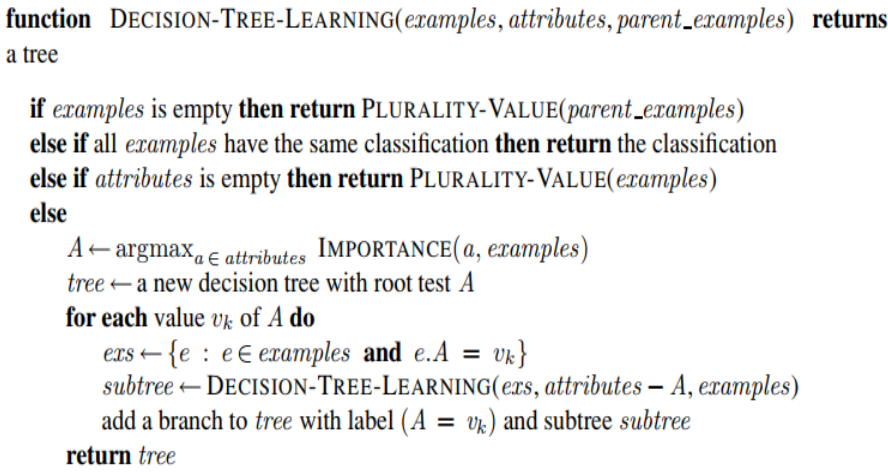

# DecisionTree-Implementation
This is an implementation of binary decision tree classifire for discrete inputs and outputs. This algorithm use gain score to select best feature for creating branchs. You can see the main algorithm in the following figure:

This algorithm does not use feature with string format and all inputs and outputs should have numberic format. The reason is I used numpy array to improve the performance and speed of the algorithm and make it use less memory. I also consider complexity of memory of this algorithm and it use memory efficiently.

There is also an example code file for bellow problem :

You can see in example.py that I convert all of the values of this problem to numberic format.

